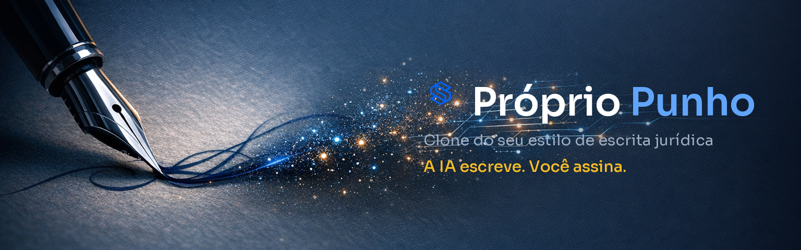

<p align="center">
  
</p>

<h1 align="center">Próprio Punho — clone do seu estilo de escrita jurídica</h1>

<p align="center">
  <a href="https://simiao-cavalcante.github.io/proprio-punho/"></a>
  
  
  <a href="LICENSE"></a>
  
</p>

<p align="center">
  🌐 <b><a href="https://simiao-cavalcante.github.io/proprio-punho/">Página do projeto</a></b> ·
  ⬇️ <b><a href="https://github.com/simiao-cavalcante/proprio-punho/raw/main/proprio-punho.skill">Baixar a skill</a></b> ·
  📖 <b><a href="SKILL.md">Ler o método</a></b>
</p>

Uma **skill** que ensina a IA a escrever com a **sua cara**: você monta um clone do seu estilo a partir das suas próprias peças, e a minuta passa a sair com a **sua estrutura, o seu vocabulário e o seu jeito de argumentar** — sem "cara de ChatGPT".

- 👤 **Perfil** — quem assina, quem você representa e o que nunca escreve. Personaliza a skill logo na primeira interação.
- 🧬 **Guia de estilo** — o DNA do seu texto em regras verificáveis (estrutura, argumentação, frase), cada uma com um exemplo real seu.
- 🚫 **Anti-estilo** — a lista do que você **nunca** escreve + pares "antes/depois". É o que remove os vícios de IA e deixa o texto com a sua digital.

> **A IA escreve. Você assina.** O clone reproduz a sua forma, não o seu juízo: a peça é sempre um rascunho para a sua revisão.

---

## ✨ O que ela faz

- **Personaliza-se para você** (Etapa 0): pergunta o bloco de assinatura, quem você representa, onde atua e as suas regras de sigilo.
- **Extrai o DNA do seu estilo** a partir de 5 a 10 peças suas, com uma engenharia reversa em **três camadas** — estrutura, argumentação e frase — em regras verificáveis, não em adjetivos vagos.
- **Redige com a sua voz** e passa um pente-fino final caçando as expressões que denunciam texto de máquina.
- **Aprende a cada peça**: toda correção sua vira uma regra nova ou um par "antes/depois" no anti-estilo.

## 🧩 Como instalar

**Claude (app ou web):** baixe o arquivo [`proprio-punho.skill`](proprio-punho.skill) e adicione na seção de **Skills / Capacidades** do Claude.

**Claude Code:** copie a pasta para `~/.claude/skills/proprio-punho/` (ou descompacte o `.skill` lá).

**Pré-requisitos:** nenhum. A skill é só texto (Markdown) — o trabalho é da IA lendo as suas peças e o seu guia de estilo.

## 🚀 Como usar

1. Acione a skill (ex.: *"vamos montar meu estilo"*).
2. Responda à **personalização** (assinatura, quem representa, gênero de peça, vetos, sigilo).
3. Anexe de **5 a 10 peças suas** do mesmo gênero, na versão final — **anonimizadas** (o próprio guia orienta como).
4. Revise o **guia de estilo** que a IA extrair e ajuste o que não parecer com você.
5. Peça uma minuta e faça o **teste cego**: compare com uma peça sua de um caso já encerrado. Cada divergência vira regra nova.
6. Pronto: peça as próximas minutas e só revise e assine.

## 📂 O que vem na skill

```
proprio-punho/
├── SKILL.md                      # o método: Etapa 0 + 3 modos (Calibração, Redação, Feedback)
├── references/
│   ├── perfil-do-autor.md        # quem você é (preenchido na Etapa 0)
│   ├── guia-de-estilo.md         # o DNA do seu estilo (preenchido na Calibração)
│   ├── anti-estilo.md            # o que você nunca escreve + pares antes/depois
│   └── analise-de-corpus.md      # o método de engenharia reversa em 3 camadas
└── modelos/                      # 1–2 peças suas, anonimizadas, como referência de forma
```

Os arquivos vêm em branco, com marcadores `{...}` para você preencher com o seu estilo — o repositório **não contém peças de ninguém**.

## ⚖️ Os limites (a parte séria)

Esta skill cuida do **estilo** da peça. Ela **não** confere jurisprudência nem substitui a sua revisão:

- **Jurisprudência sempre conferida na fonte** antes de protocolar — advogados já foram multados por litigância de má-fé por citarem julgado inventado por IA.
- **Revisão humana integral, sempre.** A peça sai com a sua cara, mas quem assina e responde é você.
- **Sigilo:** dado de cliente não entra em ferramenta de IA sem anonimização — a skill orienta o passo de anonimização antes de qualquer coisa.

## 📜 Licença

[MIT](LICENSE) — uso livre, mantendo o crédito.

## 👤 Créditos

Criado por **Simião Cavalcante** — [Instagram @prof.simiao](https://www.instagram.com/prof.simiao) · [X @simiao_c](https://x.com/simiao_c). Contribuições e sugestões são bem-vindas — abra uma *issue* ou *pull request*.
